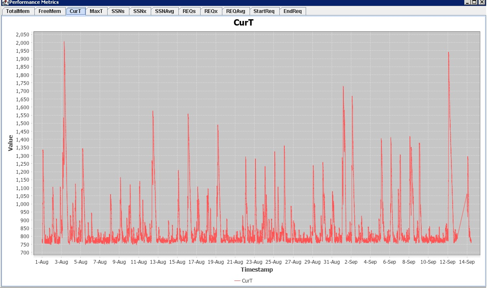

# SoftwareAG webMethods Stats log parser and plot graph for multiple stats*.log and zip files in the folder

To use the provided Java code for processing and plotting data from log and zip files, follow these steps:

1. **Download and Install Required Libraries:**

   Ensure that you have the JFreeChart library installed or added to your project's dependencies. You can download it from the [official JFreeChart website](http://www.jfree.org/jfreechart/).
   Make sure to have also the localization property files in the right place. If not some error will tell you. (e.g. **"Can't find bundle for base name org.jfree.chart.plot.LocalizationBundle, locale en_US"**

2. **Compile the code**

   e.g. run **"javac MultiFileHexDataGraph.java"**
   if needed add the class path to your libraries e.g.  **"javac -cp C:\jfreechart-1.5.3\src\main\java MultiFileHexDataGraph.java"**
 
4. **Update the Directory Path:**

   The executable expects the files to parse in a subfolder of the execution place ".\\files\" 

5. **Run the Application:**

   Run the Java application. e.g. **"java MultiFileHexDataGraph"**
   This will launch a graphical user interface (GUI) with tabs for each metric. The application will automatically process and plot data from log and zip files in the specified directory.

7. **View the Charts:**

   The charts will be displayed in separate tabs based on the metric names. You can switch between tabs to view the charts for different metrics.

   

8. **Interact with the Charts:**

   You can interact with the charts as you would with any standard charting application. You can zoom in, zoom out, pan, and save charts as images.

9. **Close the Application:**

   Close the application when you are done viewing the charts.

The provided code handles both log and zip files, reads data from them, and dynamically creates and updates charts for each metric. The charts are displayed in a tabbed interface for easy navigation.

Make sure to adjust the `directoryPath` variable in the `main` method to point to your specific directory containing the log and zip files.

**Field description in stats file**

TotalMem - The total amount of memory available to the Java virtual 

FreeMem - The amount of unused memory that is currently available to the Java virtual machine

CurT - The number of system threads currently active

MaxT - The highest number of system threads that have ever been active concurrently on the server

SSNs - The number of sessions currently active

SSNx - The highest number of sessions that were active concurrently on the server

SSNAvg - The average length of a session lifetime

REQs - The number of service requests currently executing

REQx - The maximum number of service requests concurrently executing during the last poll cycle (Default: 1 minute) service requests during the last poll cycle (1 minute)

REQAvg - The average execution time length for the service requests during the last poll cycle (Default: 1 minute)

StartReq - The number of service requests that started during the last poll cycle (Default: 1 minute)

EndReq - The number of service requests that terminated during the last poll cycle (Default: 1 minute) 
